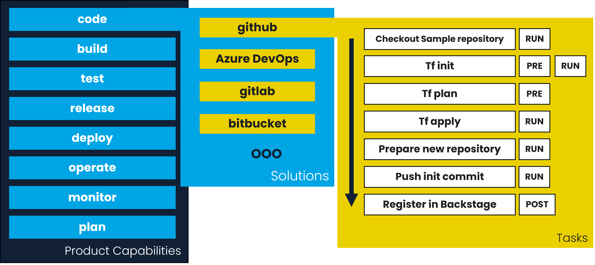

Lemniscat is a Framework to provide a DevOps approach to the development of products. 
To be operational, the framework needs to be used with a runtime and plugins.
They are based on the following principles:

- **Product oriented**: The framework is designed to be used in the development of products, not in the development of software. This means that the framework is designed to be used in the development of products that are composed of software, hardware, and other components.
- **Modular**: The framework is designed to be modular, so that it can be used in different contexts and with different tools.
- **Extensible**: The framework is designed to be extensible, so that it can be plugged with different tools and solutions that are not yet supported and you judge necessary.
- **Open source**: The framework, runtime and plugins are open source, so that it can be used and modified by anyone.
- **Community driven**: The framework, runtime and plugins is designed to be community driven, so that it can be used and improved by a community of users and developers.
- **DevOps oriented**: The framework is designed to be used in a DevOps approach, so that it can be used to activate all the capabilities of DevOps (code, build, test, ...).
- **CI/CD solution software agnostic**: The runtime is designed to be used with any CI/CD solution, but not only if you prefer you can use it with a simple script, a workflow runner, or any other solution.
- **Cloud agnostic**: The runtime is designed to be used with any cloud provider, so that it can be used with any cloud provider.
- **locally executable**: The runtime is designed to be executed locally, so that it can be used in a local environment to help the development of products (for example).

## System model

The framework is based on the following system model:

### Capabilities

The capabilities are the DevOps steps that can be activated during the deployment of a product. It's designed to be sure that all the DevOps aspects are covered during the design of a product. 
For each capability, you can define the [solutions](#solutions) that need to be executed to activate the capability.
For example, for capability code you can define Github and Gitlab as [solutions](#solutions) to activate the capability when the product is deployed.

### Solutions

The solutions are the tools that can be used to execute the [capabilities](#capabilities). For example, you can use Jenkins to execute the build capability, or you can use Ansible to execute the deployment capability.
For each solution, you can define a workflow with the [tasks](#tasks) that need to be executed to activate the capability.
For example, for Azure (in operate capability), you can define the [tasks](#tasks) that need to be executed to deploy infrastructure with Terraform.

### Tasks

The tasks are the actions that need to be executed to activate the capability. For example, you can define a task to execute a script, or a task to execute a terraform command.
For each task, you need to tag in witch [step](#step-concept) it needs to be executed, and the parameters that need to be used to execute the task.
You can define many tags for a task, and the task will be executed in the same step as the tag.
In the same step, the tasks are executed in the same order as defined in the manifest file.

### Step concept

The step is the concept that defines the big stages of the instantiation of the product. It's designed to be sure that all the [tasks](#tasks) are executed in the right order during the instantiation of the product.
Their are 4 steps:

- **pre**: The step to prepare the instantiation of the product. For example, you can use this step to prepare the environment to deploy the product, prepare the configuration files, generate terraform plan, ...
- **run**: The step to execute the instantiation of the product. For example, you can use this step to deploy the infrastructure, define access rights, create git repository, ...
- **post**: The step to finalize the instantiation of the product. For example, you can use this step to execute the tests, generate the documentation, register the product in the CMDB, ...
- **clean**: The step to clean the instantiation of the product. For example, you can use this step to delete the infrastructure, delete the git repository, ...
